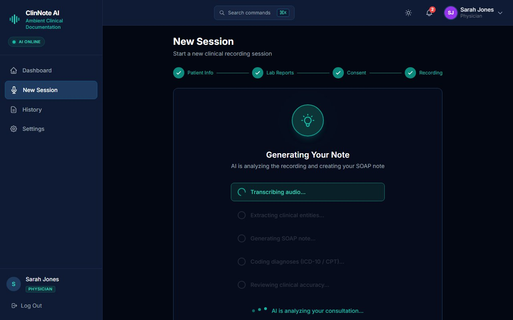
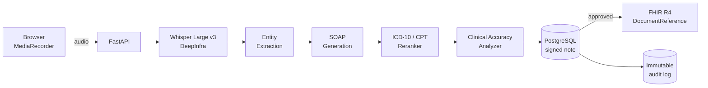
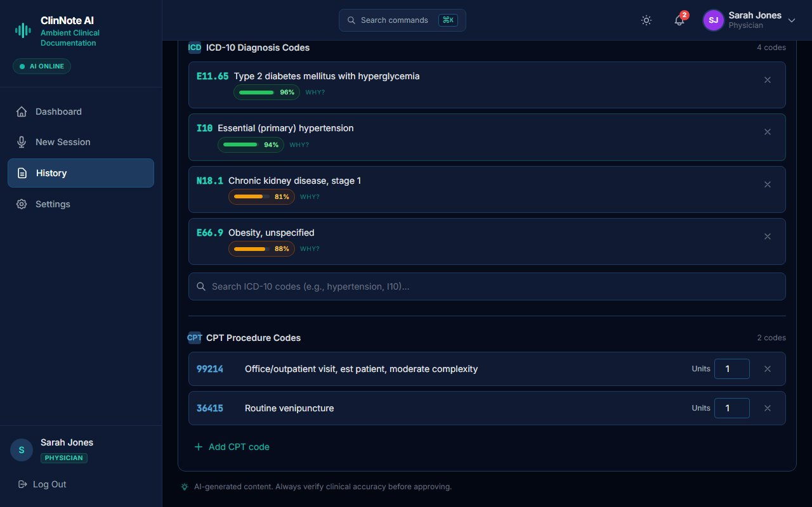
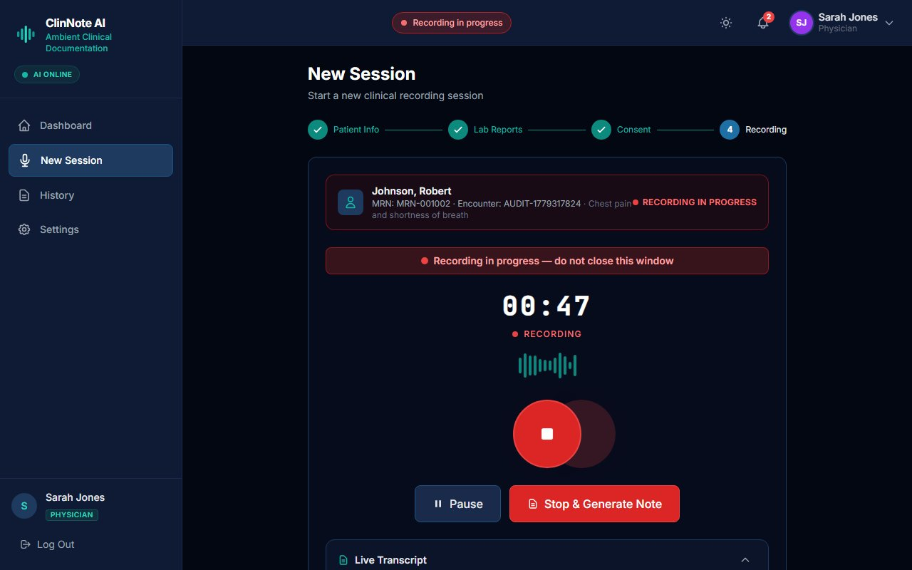
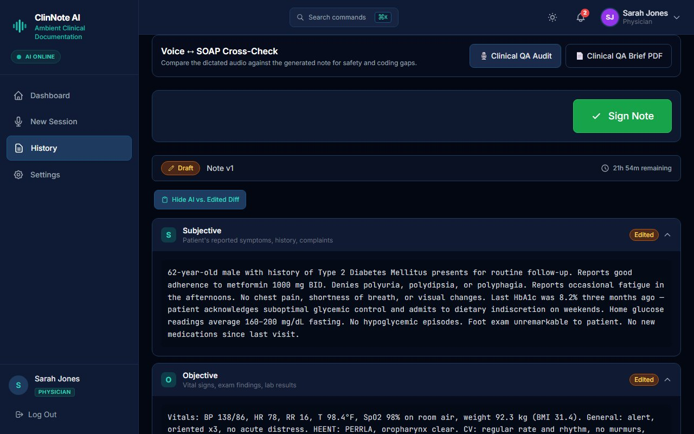
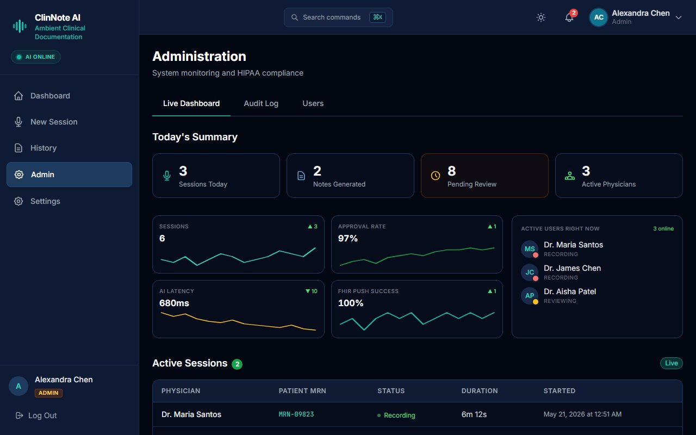
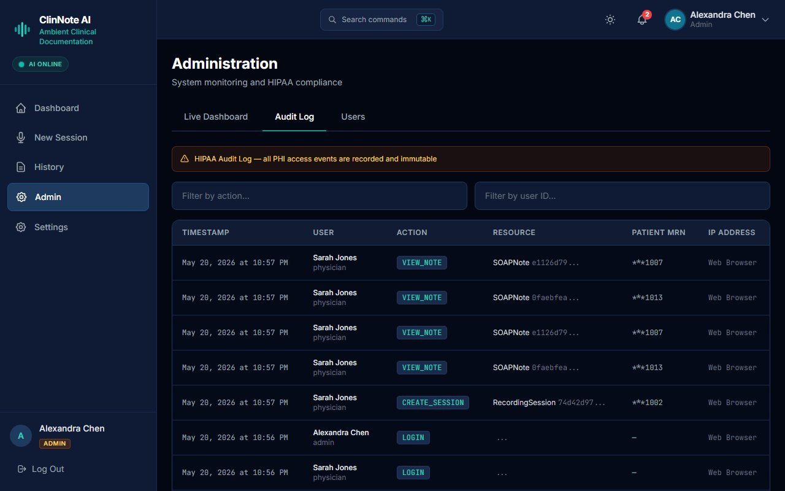

# ClinNote AI

> Turns a physician's spoken consultation into a signed, ICD-10-coded SOAP note in under 60 seconds — replacing 15–30 minutes of after-hours typing per patient.

<p align="center">
  
</p>

---

## The problem

Industry studies report physicians spend **~2 hours on documentation for every hour of patient care**. Most of that happens after clinic hours: rewriting handwritten notes, finding ICD-10 codes by hand, pasting data into the EHR. Burnout follows. Small and mid-size clinics can't afford enterprise ambient-AI scribes priced for hospital systems.

## What this does

ClinNote records the physician–patient consultation, transcribes it with Whisper Large v3, extracts clinical entities, generates a structured SOAP note, suggests ICD-10 and CPT codes with confidence scores, runs a clinical-accuracy check, and pushes the signed note to any HL7 FHIR R4 endpoint. The physician reviews and approves in the browser. The full intake-to-signed-note loop runs in under 60 seconds for a typical 12-minute visit.

## Real-world scenario

> Dr. Sarah Jones finishes a 12-minute consultation with a Type 2 diabetic patient. She clicks **Stop Recording**. Five seconds of "Transcribing audio… extracting clinical entities… generating SOAP note… coding diagnoses (ICD-10/CPT)… reviewing clinical accuracy…" later, she sees a draft note: chief complaint, HPI, exam, assessment, plan — with four ICD-10 codes (E11.65 at 96 % confidence, I10 at 94 %, N18.1 at 81 %, E66.9 at 88 %) and two CPT codes (99214 office visit, 36415 venipuncture). She edits two lines, signs, and the FHIR DocumentReference posts to her clinic's EHR.

**Before this tool:**
- Hand-write or dictate raw notes during visits
- Spend 15–30 min after each patient typing them up
- Look up ICD-10 codes manually in a code book or ICD-10 site
- Paste into the EHR by hand
- **Total: ~2 hours per day after clinic on documentation**

**With this tool:**
- Record the visit (one button)
- Review and sign the AI-drafted note (typically 60–90 seconds of edits)
- **Total: ~5 minutes per visit, in-clinic, none after hours**

## Example

**Input** — the recorded consultation, transcribed by Whisper Large v3:

```
PHYSICIAN: Good morning, what brings you in today?
PATIENT:   I've had increased thirst and frequent urination for about three weeks.
           I'm also feeling more tired than usual.
PHYSICIAN: Any blurred vision? Numbness in your feet?
PATIENT:   Some blurry vision when I read at night. No numbness.
...
```

**Output** — structured SOAP note + codes:

```json
{
  "soap": {
    "subjective": "62-year-old male with 3 weeks of polyuria, polydipsia, and fatigue. Reports intermittent blurred vision at night...",
    "objective": "BMI 31.2. BP 142/88. Random glucose 248 mg/dL on fingerstick.",
    "assessment": "Newly suspected Type 2 diabetes mellitus with hyperglycemia, uncontrolled hypertension, obesity.",
    "plan": "Order HbA1c and CMP. Start metformin 500 mg BID. Lifestyle counseling..."
  },
  "icd10": [
    {"code": "E11.65", "description": "Type 2 diabetes mellitus with hyperglycemia", "confidence": 0.96},
    {"code": "I10",    "description": "Essential (primary) hypertension",            "confidence": 0.94},
    {"code": "N18.1",  "description": "Chronic kidney disease, stage 1",             "confidence": 0.81},
    {"code": "E66.9",  "description": "Obesity, unspecified",                        "confidence": 0.88}
  ],
  "cpt": [
    {"code": "99214", "units": 1, "description": "Office visit, established patient, moderate complexity"},
    {"code": "36415", "units": 1, "description": "Routine venipuncture"}
  ]
}
```

## Why it saves time

| Metric | Manual approach | ClinNote AI | Improvement |
|---|---|---|---|
| Time per note (12-min visit) | 15–30 min after clinic | **~60–90 s** of in-clinic review | 15–30× faster |
| Documentation burden / day | ~2 hours after hours | ~5 min per patient, in-clinic | ~24× fewer after-hours minutes |
| ICD-10 lookup steps | open code book → search → copy → paste | one click on suggested code | 4 steps → 1 |
| EHR push | manual copy-paste | one-button FHIR DocumentReference | manual → automated |

## Key features

- **Ambient consultation recording** via the browser MediaRecorder API; no app install.
- **Whisper Large v3 transcription** (DeepInfra) with English clinical vocabulary tuning.
- **Multi-step AI pipeline** rendered as live progress in the UI: Transcription → Entity Extraction → SOAP Generation → ICD-10/CPT Coding → Clinical Accuracy Review.
- **ICD-10 / CPT coding with per-code confidence scores** and a "Why?" reasoning drawer for every code.
- **AI-vs-human diff view** so the physician can see exactly which lines they edited from the AI draft (audit and training signal).
- **HL7 FHIR R4 export** — DocumentReference resource pushed to any FHIR endpoint.
- **MFA (TOTP)** on physician + admin login; bcrypt password hashing; JWT session.
- **Immutable audit log** of every note generation, edit, sign, and FHIR push.
- **Admin live dashboard** showing in-flight notes, average generation latency, and consent status.

## How it works

The non-obvious decision was to **split AI work into five short single-purpose stages** instead of one giant prompt. The transcription step runs Whisper (cheap, deterministic). The entity-extraction step runs a small structured-output call. The SOAP-generation step uses a larger model with the entities already extracted as context. The coding step uses a dedicated ICD-10 reranker. The clinical-accuracy step runs a separate cross-check pass.

This staged approach makes every intermediate state inspectable (the user literally sees the 5-step ladder fill in), gives each stage its own confidence band, and lets the cheap deterministic stages fail fast without burning expensive LLM tokens. It also keeps the per-stage prompts short, which is why per-stage hallucinations stay rare — each stage only sees the slice it needs.

## Architecture



## Screenshots

### Five-stage AI pipeline in flight


*The pipeline renders each stage live so the physician sees exactly what the model is doing.*

### ICD-10 and CPT coding with confidence



*Each code shows a confidence bar (green ≥90 %, amber 80–89 %) and a "Why?" link that opens the reasoning drawer.*

### Recording interface



*Stepper layout for the four-step intake: patient info → lab reports → consent → recording.*

### AI-vs-human diff



*Every approved note keeps a diff so the audit log can show what the AI proposed vs what the physician signed.*

### Admin live dashboard



*Real-time view of all in-flight notes across the clinic.*

### Immutable audit log



*Every state change is logged with actor + timestamp; required for clinical compliance.*

## Stack

- **Language:** Python 3.11 (backend) + TypeScript (frontend)
- **Backend:**
  - `fastapi` + `uvicorn` — async API surface with first-class OpenAPI for the frontend
  - `sqlalchemy[asyncio]` + `asyncpg` + `alembic` — async ORM and versioned migrations on PostgreSQL
  - `celery` + `redis` — async work queue for the transcription and AI stages so the HTTP request returns immediately
  - `openai` SDK — used against the DeepInfra-hosted Whisper Large v3 and for SOAP generation
  - `azure-ai-documentintelligence` — OCR for uploaded lab PDFs in the wizard
  - `python-jose` + `passlib[bcrypt]` + `pyotp` — JWT auth, bcrypt hashing, TOTP MFA
  - `slowapi` — rate limiting on all auth and AI endpoints
- **Frontend:**
  - `react` + `react-router-dom` + `vite` — SPA with code-split routes
  - `@tanstack/react-query` — server-state caching and optimistic updates for note edits
  - `zustand` — small client store for session and wizard state
  - `react-hook-form` + `zod` — typed form validation on intake, lab, and consent steps
- **Infra:** Docker Compose stack (`postgres`, `redis`, `api`, `worker`, `frontend`). FHIR target is any HL7 R4 server.

## Quick start

```bash
git clone https://github.com/Guembri01/clinnote-ai.git
cd clinnote-ai
cp .env.example .env   # fill in DEEPINFRA_API_KEY, OPENAI_API_KEY, AZURE_DI_ENDPOINT/KEY, JWT_SECRET
docker compose up -d
# Backend on http://localhost:8003 — Swagger at /docs
# Frontend on http://localhost:3000
```

Run backend tests:

```bash
cd backend
python -m venv .venv && .venv/Scripts/activate
pip install -r requirements.txt
pytest
```

## Limitations

- **Batch transcription only.** Audio is sent to Whisper after the recording stops; there is no live in-call captioning. A streaming Whisper provider could close this gap.
- **English-only clinical vocabulary today.** The SOAP and coding prompts assume US clinical terminology and the ICD-10-CM code system. Non-US deployments need a coding-system swap.
- **No persistent context across visits.** Each consultation is treated as standalone; long-term patient history is not yet woven into the SOAP generation prompt.
- **Single-physician sessions.** Multi-speaker diarization is not yet enabled; the transcript treats the recording as one stream with role tags inferred by the SOAP step.

## Roadmap

- [ ] Streaming Whisper for live in-call captioning (target: < 1 s per word).
- [ ] French (`fr-FR`) clinical vocabulary + ICD-10-FR coding system.
- [ ] Multi-speaker diarization for nurse + physician + patient sessions.
- [ ] Patient-history-aware SOAP prompt (RAG over the last *N* visits).
- [x] HL7 FHIR R4 DocumentReference push.
- [x] ICD-10 + CPT confidence scoring.
- [x] MFA on physician + admin login.
- [x] Immutable audit log on every note state change.

## What I learned

- **Splitting one giant clinical prompt into five short stages** raised observability and lowered the cost per note. Most stages don't need an expensive model. The user also stops doubting the AI when they can watch each step finish.
- **Confidence scores are a UX problem, not just a model problem.** A code at 81 % needs a different visual treatment than a code at 96 % — green/amber/red bars + a "Why?" drawer turned skeptical physicians into willing reviewers.

## License

Released under the [MIT License](LICENSE).

## Acknowledgements

Built with [FastAPI](https://fastapi.tiangolo.com/), [SQLAlchemy](https://www.sqlalchemy.org/), [React](https://react.dev/), [TanStack Query](https://tanstack.com/query), [Whisper](https://github.com/openai/whisper) (Large v3 via [DeepInfra](https://deepinfra.com/)), and [Azure Document Intelligence](https://learn.microsoft.com/en-us/azure/ai-services/document-intelligence/).
